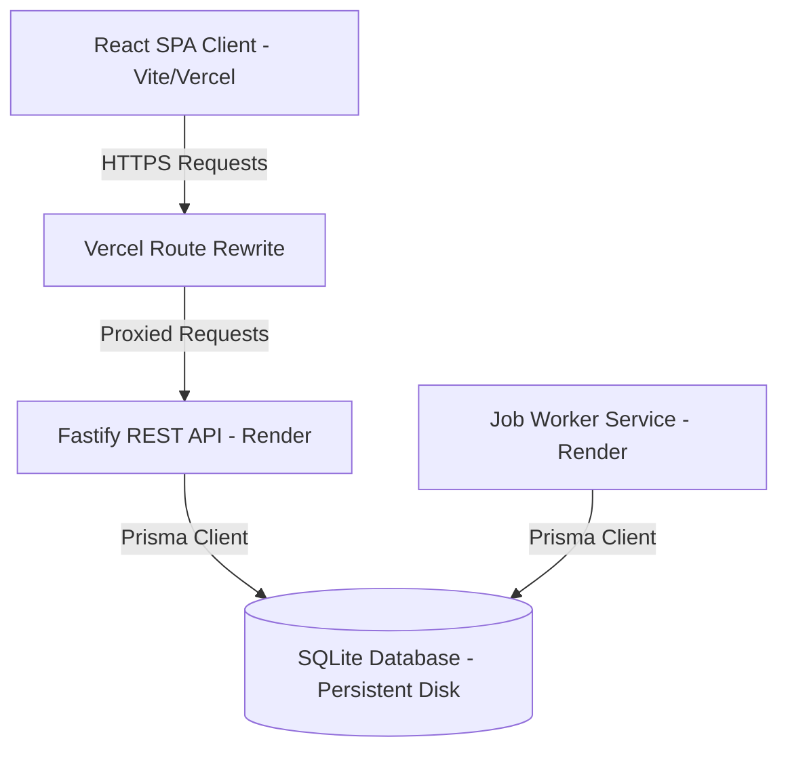
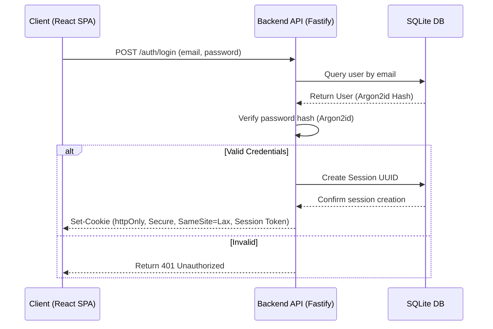
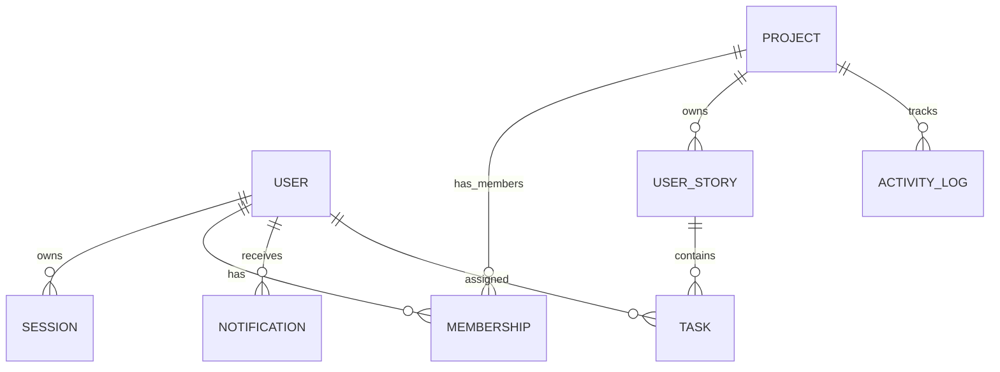

# SprintGrid — Agile Project Workspace

[](https://render.com/deploy?repo=https://github.com/Balavignesh145/SPRINT-GRID---KPIT-Assignment)

> Plan clearly. Execute confidently. Ship together.

SprintGrid is a full-stack, production-minded agile project management application designed for small engineering teams (3–10 users). It organizes work into a clean hierarchy: **Project** $\rightarrow$ **User Story** $\rightarrow$ **Task**, and features a Kanban-style dashboard, cursor-paginated activity logs, automatic in-app notifications, and a database-backed background job worker.

---

## Table of Contents
1. [Project Overview & Architecture](#project-overview--architecture)
2. [Get Started](#get-started)
3. [Authentication Flow](#authentication-flow)
4. [Async Workflow](#async-workflow)
5. [Database Schema Documentation](#database-schema-documentation)
6. [API Documentation](#api-documentation)
7. [Design Decisions & Trade-offs](#design-decisions--trade-offs)
8. [Security Considerations](#security-considerations)
9. [AI Usage Statement](#ai-usage-statement)
10. [Future Enhancements](#future-enhancements)
11. [Demo](#demo)

---

## Project Overview & Architecture

SprintGrid is built using a modern full-stack monorepo structure. It prioritizes information density, developer velocity, type safety, and clean separation of concerns.

### Architecture Diagram


### Architecture Notes
* **Frontend SPA:** Built with React, TypeScript, and Vite. Utilizes Tailwind CSS and shadcn/ui for UI primitives, TanStack Query (v5) for remote state synchronization, and `dnd-kit` for drag-and-drop workflow adjustments.
* **Backend API:** Fastify server utilizing type-safe schemas via Zod and fast routing matching algorithms.
* **ORM & Database:** SQLite database managed securely through Prisma. SQLite provides minimal setup overhead and ultra-fast disk reads/writes.
* **Background Worker:** A persistent, transactional job worker executing in a background thread to handle asynchronous processing without external message queues.

---

## Get Started

Follow these instructions to run the entire project on your local machine.

### 1. Prerequisites
* **Node.js:** $\ge$ 20.19.0
* **npm:** $\ge$ 10.0.0

### 2. Environment Setup
Create a `.env` file at the root of the project:
```bash
cp .env.example .env
```
Inside your `.env`, ensure the following are defined:
```env
DATABASE_URL="file:./dev.db"
SESSION_SECRET="a-very-long-cryptographically-secure-secret-key-32-chars"
SESSION_TTL_SECONDS=604800
RATE_LIMIT_MAX=120
WEB_ORIGIN="http://localhost:5180"
```

### 3. Database Migration & Seeding
Install monorepo dependencies, compile database tables, and import mock demonstration data:
```bash
# Install all package dependencies
npm install

# Run database migrations using Prisma
npx prisma migrate dev --schema prisma/schema.prisma

# Seed demo database accounts & tasks
npm run db:seed --workspace=@sprintgrid/api
```

### 4. Startup Commands
Run all three workspace components concurrently in separate shell terminals:

* **Terminal 1: Fastify Backend API**
  ```bash
  npm run dev:api
  ```
* **Terminal 2: Vite React Frontend**
  ```bash
  npm run dev:web
  ```
* **Terminal 3: Asynchronous Job Worker**
  ```bash
  npm run dev:worker
  ```

---

## Authentication Flow

SprintGrid uses secure, cookie-based session state verification rather than storing credentials in browser local storage.



### Authentication Details:
1. **Password Hashing:** Passwords are hashed and checked using **Argon2id**, the industry standard for credential storage.
2. **Session Cookies:** Upon successful verification, the API issues a cryptographically secure token. The token is stored in the browser using an `HttpOnly`, `Secure`, `SameSite=Lax` cookie. This mitigates Cross-Site Scripting (XSS) and Cross-Site Request Forgery (CSRF) vectors.
3. **Logout:** The logout handler deletes the session key inside the database and clears the browser cookie.

---

## Async Workflow

SprintGrid includes a persistent, database-backed job runner designed to run scheduled actions and retry failed workflows with exponential backoff.

### Job Schema Model
The `Job` database model maintains status tracking:
* `id`: Unique identifier
* `type`: Task identifier (e.g. `SEND_TASK_REMINDER`, `GENERATE_DAILY_DIGEST`)
* `payload`: Structured JSON parameters
* `status`: State machine tag (`PENDING`, `PROCESSING`, `COMPLETED`, `FAILED`)
* `attempts`: Number of retries executed
* `maxAttempts`: Maximum retries allowed before entering failure state
* `availableAt`: Timestamp when the job is next eligible to execute
* `lastError`: Debug logs preserved on retry failures

### Worker Queue Behavior:
1. **Poller Loop:** The worker queries SQLite for records where `status = PENDING` and `availableAt <= CurrentTime`.
2. **Transaction Handling:** The job status is locked to `PROCESSING` to prevent duplicate concurrent runs.
3. **Exponential Backoff:** If a job fails, the worker increments `attempts`, writes the stack trace to `lastError`, and calculates a delayed retry time (`2^attempts * 10 seconds`). 
4. **Terminal Failure:** If `attempts >= maxAttempts`, the job is marked as `FAILED` and quarantined for engineering review.

---

## Database Schema Documentation

SQLite database relations are structured inside the [prisma/schema.prisma](prisma/schema.prisma) file.

### Entity Relationship Diagram


### Table Structure Overview
1. **User:** User credentials, names, and creation timestamps.
2. **Session:** Cookie credentials connected to users with precise expiry dates.
3. **Project:** Workspaces containing user stories and custom prefix keys.
4. **Membership:** Junction table mapping User access permissions to Projects.
5. **UserStory:** Modular requirements with priority fields, status tags, and story points.
6. **Task:** Action items linked to user stories, tracking checklists, due dates, and drag reordering positions.
7. **ActivityLog:** Auditing timeline tracking project modifications.
8. **Notification:** User-facing alerts.
9. **Job:** Persistent background queue tasks.

---

## API Documentation

The REST API is structured at `/api/v1`.

| Method | Endpoint | Description | Payload Schema |
| :--- | :--- | :--- | :--- |
| **POST** | `/api/v1/auth/register` | Register new user | `{ email, password, name }` |
| **POST** | `/api/v1/auth/login` | Sign into account | `{ email, password }` |
| **POST** | `/api/v1/auth/logout` | Invalidate cookie | *None* |
| **GET** | `/api/v1/auth/me` | Fetch authenticated user | *None* |
| **GET** | `/api/v1/projects` | List projects user belongs to | *None* |
| **POST** | `/api/v1/projects` | Create a new project | `{ name, description }` |
| **GET** | `/api/v1/projects/:id` | Fetch specific project details | *None* |
| **POST** | `/api/v1/projects/:projectId/stories` | Create a user story | `{ title, description, points, priority, status }` |
| **GET** | `/api/v1/projects/:projectId/stories` | List user stories in project | *None* |
| **POST** | `/api/v1/stories/:storyId/tasks` | Create task under story | `{ title, priority, status, dueDate, assigneeId }` |
| **PATCH** | `/api/v1/tasks/:id` | Edit task status, order, or text | `{ title, priority, status, order }` |
| **GET** | `/api/v1/projects/:projectId/activity` | Cursor-paginated activity logs | *Query: cursor* |
| **GET** | `/api/v1/notifications` | Fetch active alerts | *None* |
| **POST** | `/api/v1/notifications/:id/read`| Mark notification as read | *None* |

---

## Design Decisions & Trade-offs

* **Vite React Monorepo vs Next.js:** We opted for a Vite SPA alongside a Fastify REST API. While Next.js provides hybrid server rendering, this decoupled architecture allows independent frontend scaling and guarantees low-overhead responses from Fastify without serverless startup delays.
* **SQLite with Prisma:** We selected SQLite for simplicity and rapid prototyping. SQLite runs directly as a local database file, which completely bypasses the latency of remote database queries. For enterprise scaling, the Prisma engine allows migrating to PostgreSQL with a single configuration line change.
* **REST vs GraphQL:** We selected REST endpoints due to their compatibility, caching ease, and predictable routing behavior. It allows for strict request schemas validated via Zod at the routing level.

---

## Security Considerations

1. **HttpOnly Cookies:** Mitigates browser-side token manipulation, preventing XSS vulnerabilities.
2. **Helmet Security Headers:** Implemented via `@fastify/helmet` to configure Strict-Transport-Security, X-Frame-Options, and Content-Security-Policy (CSP).
3. **CORS Configuration:** Allowlist restricted to specific frontend origins; wildcards are rejected.
4. **Rate Limiting:** Protects credential validation points from brute-force scripts using `@fastify/rate-limit`.
5. **Input Sanitation:** All incoming path params, queries, and request bodies are validated against strict Zod parsing rules.

---

## AI Usage Statement

SprintGrid was designed and built with the assistance of **Antigravity**, an agentic AI coding assistant from Google DeepMind. The AI was used for generating base route schemas, optimizing responsiveness across mobile viewports, formatting UI primitives, creating test configurations, and drafting design document structures. All business logic, database relationships, transaction structures, and security settings were audited and verified for correctness.

---

## Future Enhancements

If given more development time, the following features would be implemented:
1. **WebSockets Integration:** Real-time updates on the Kanban board to reflect coworker modifications instantly without manual refetching.
2. **Project Templates:** Pre-configured project setups (e.g. Scrum sprints vs. Kanban queues) to speed up initial configuration.
3. **Interactive Gantt Charts:** Visualize user story dependencies and target release timelines in a timeline calendar view.

---

## Demo

* **Live Website URL:** [https://sprint-grid-kpit-assignment-api.vercel.app/](https://sprint-grid-kpit-assignment-api.vercel.app/)
* **Walkthrough Video:** [Google Drive Video Demo Link](https://drive.google.com/file/d/1CqrRt8r8z-DDupLip4KqroIr0ly7UXiq/view?usp=sharing)
