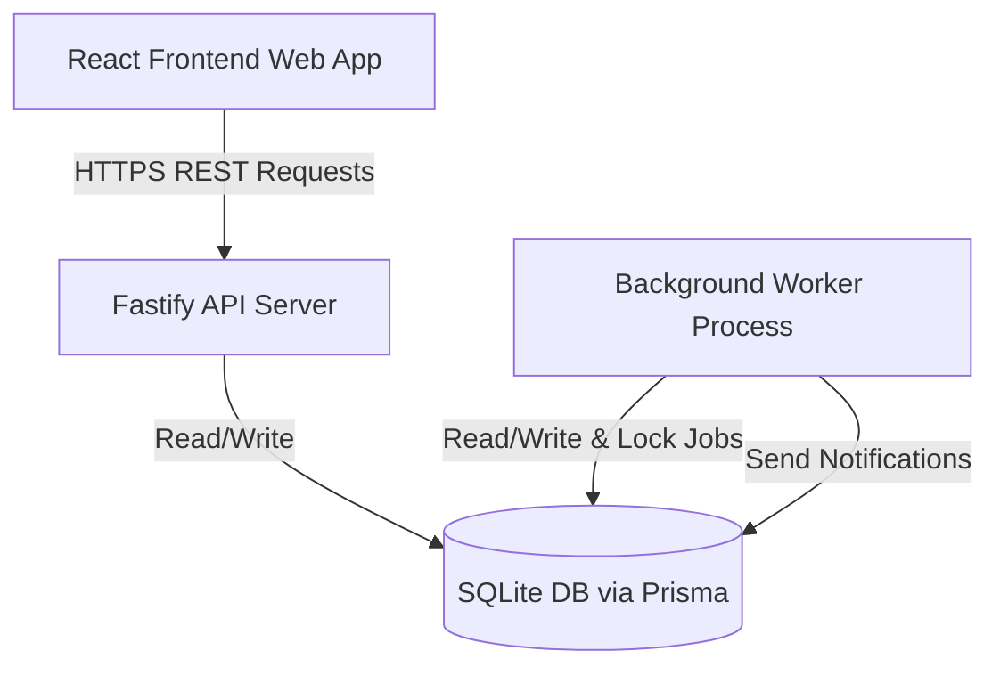

# SprintGrid — Architecture Documentation

This document describes the high-level architecture and design of SprintGrid — Agile Project Workspace.

## Monorepo Layout

SprintGrid is structured as a TypeScript-first monorepo using npm workspaces:

```
├── apps/
│   ├── api/          # Fastify-based backend REST API
│   └── web/          # React + Vite frontend SPA
├── packages/
│   └── shared/       # Transport-safe contracts, Zod schemas, and types
├── prisma/
│   ├── schema.prisma # SQLite database models
│   └── seed.ts       # Database seed data
└── docs/             # Technical specifications & decisions
```

---

## Component Architecture



### 1. Frontend SPA (`apps/web`)
- **Routing:** Handled via `react-router-dom`. Auth status guards access to dashboard and project views.
- **Server State Management:** Handled via `@tanstack/react-query` to provide caching, automatic refetching, and state invalidation.
- **Form Validation:** React Hook Form + Zod.
- **Drag-and-Drop:** Built using `@dnd-kit/core` and `@dnd-kit/sortable` for the Kanban board, utilizing local state for optimistic UI updates with automatic API mutation rollback on failure.
- **CSS / Style System:** Tailwind CSS using custom SprintGrid CSS variables (`--color-brand`, etc.) defined in `index.css`.

### 2. Backend REST API (`apps/api`)
- **Fastify Server:** Chosen for high performance and low overhead compared to Express. Built-in JSON schema validation using Zod.
- **Authentication:** Cookie-based sessions. Uses cryptographically secure random session tokens (hex encoded), which are SHA-256 hashed before database entry. Timing attack protection is built into credential checking.
- **Authorization & IDOR Protection:** Server-side preHandlers check that the authenticated user belongs to the project before executing mutations or reads on nested resources (Project $\rightarrow$ User Story $\rightarrow$ Task).
- **Documentation:** Built-in OpenAPI specification generated by `@fastify/swagger` and served visually at `/api/docs`.

### 3. Database Layer (`prisma`)
- **SQLite Database:** Zero-configuration file-based database, ideal for small teams (3–10 users) since sqlite supports concurrent reads and single-writer locks with low latency on local disks.
- **Prisma Client:** A type-safe ORM to perform queries and manage schema migrations.

### 4. Background Job System & Worker (`apps/api/src/worker.ts`)
- **Persistent Database Queue:** Multi-worker safe polling loop that grabs tasks from the `Job` table using optimistic locking.
- **Exponential Backoff:** If a job fails, the worker calculates an exponential backoff time (up to 1 hour max) and logs the failure details.
- **Jobs Implemented:**
  - `CHECK_OVERDUE_TASKS`: Scans tasks for due dates in the past and generates notifications for the assignee.
  - `DAILY_DIGEST`: Generates a daily summary of recent project activity logs for all members.
  - `SEND_TASK_REMINDER`: Scheduled reminder notifications for upcoming task deadlines.
