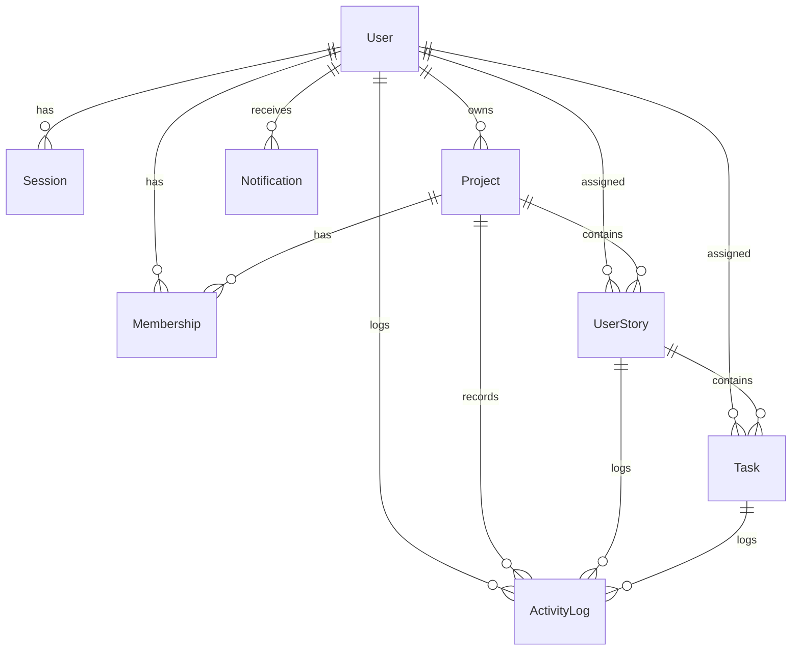

# SprintGrid — Database Documentation

This document describes the database schema, models, relationships, and indexing strategy for SprintGrid.

## Technology Choice
SprintGrid uses **SQLite** through the **Prisma ORM**.
- SQLite is chosen for simplicity, zero configuration, and high speed under typical small team loads (3–10 users).
- Prisma provides strict type safety, auto-generated TypeScript clients, and reliable schema migrations.

---

## Schema Overview

---

## Models & Fields

### 1. User
Represents a user account in the system.
- `id` (String, PK, cuid)
- `email` (String, Unique)
- `name` (String)
- `passwordHash` (String) - Argon2id secure hash
- `createdAt` / `updatedAt` (DateTime)

### 2. Session
Stores cookie-based sessions.
- `id` (String, PK, cuid)
- `tokenHash` (String, Unique) - SHA-256 hash of raw session token
- `userId` (String, FK $\rightarrow$ User.id)
- `expiresAt` (DateTime)
- `revokedAt` (DateTime, Nullable)
- `createdAt` (DateTime)

### 3. Project
A workspace container for user stories and tasks.
- `id` (String, PK, cuid)
- `name` (String)
- `key` (String, Unique) - Short uppercase key (e.g., `NSTAR`)
- `description` (String, Nullable)
- `archived` (Boolean) - Soft-delete flag
- `ownerId` (String, FK $\rightarrow$ User.id)
- `createdAt` / `updatedAt` (DateTime)

### 4. Membership
Maps users to projects with roles.
- `id` (String, PK, cuid)
- `projectId` (String, FK $\rightarrow$ Project.id)
- `userId` (String, FK $\rightarrow$ User.id)
- `role` (Enum: `OWNER`, `ADMIN`, `MEMBER`, `VIEWER`)
- `createdAt` (DateTime)
- **Constraints:** Unique on `(projectId, userId)`

### 5. UserStory
A requirement mapping to the Project.
- `id` (String, PK, cuid)
- `projectId` (String, FK $\rightarrow$ Project.id)
- `assigneeId` (String, FK $\rightarrow$ User.id, Nullable)
- `title` (String)
- `description` (String, Nullable)
- `acceptanceCriteria` (String, Nullable)
- `status` (Enum: `BACKLOG`, `TODO`, `IN_PROGRESS`, `IN_REVIEW`, `DONE`)
- `priority` (Enum: `LOW`, `MEDIUM`, `HIGH`)
- `storyPoints` (Int, Nullable)
- `position` (Float) - Lexicographical sorting weight
- `archived` (Boolean)
- `createdAt` / `updatedAt` (DateTime)

### 6. Task
An implementation step under a UserStory.
- `id` (String, PK, cuid)
- `storyId` (String, FK $\rightarrow$ UserStory.id)
- `assigneeId` (String, FK $\rightarrow$ User.id, Nullable)
- `title` (String)
- `description` (String, Nullable)
- `status` (Enum: `BACKLOG`, `TODO`, `IN_PROGRESS`, `BLOCKED`, `IN_REVIEW`, `DONE`)
- `priority` (Enum: `LOW`, `MEDIUM`, `HIGH`)
- `dueDate` (DateTime, Nullable)
- `position` (Float) - Lexicographical sorting weight
- `archived` (Boolean)
- `createdAt` / `updatedAt` (DateTime)

### 7. ActivityLog
Audit trail of project actions.
- `id` (String, PK, cuid)
- `projectId` (String, FK $\rightarrow$ Project.id)
- `actorId` (String, FK $\rightarrow$ User.id, Nullable)
- `storyId` (String, FK $\rightarrow$ UserStory.id, Nullable)
- `taskId` (String, FK $\rightarrow$ Task.id, Nullable)
- `action` (String) - E.g. `task.updated`
- `summary` (String)
- `createdAt` (DateTime)

### 8. Notification
User alerts.
- `id` (String, PK, cuid)
- `userId` (String, FK $\rightarrow$ User.id)
- `type` (String)
- `title` (String)
- `body` (String)
- `readAt` (DateTime, Nullable)
- `createdAt` (DateTime)

### 9. Job
Queue storage for background worker.
- `id` (String, PK, cuid)
- `type` (String) - E.g. `DAILY_DIGEST`
- `payload` (String) - JSON object arguments
- `status` (Enum: `PENDING`, `PROCESSING`, `RETRYING`, `COMPLETED`, `FAILED`)
- `attempts` (Int)
- `maxAttempts` (Int)
- `availableAt` (DateTime) - Execution date/time (used for scheduling delays)
- `startedAt` (DateTime, Nullable)
- `completedAt` (DateTime, Nullable)
- `lastError` (String, Nullable)
- `createdAt` / `updatedAt` (DateTime)

---

## Indexing Strategy
To maintain low latency on SQLite as the database grows, specific indices cover common queries:
1. **User email lookup:** `User.email` is uniquely indexed.
2. **Session lookup:** Indexed on `[userId, expiresAt]`.
3. **Project query:** Index on `[ownerId, archived]` to load owner projects.
4. **Members lookup:** Index on `[userId, projectId]` to accelerate user's active workspaces.
5. **Story list sorting:** Index on `[projectId, status, position]` to serve project boards instantly.
6. **Task list sorting:** Index on `[storyId, status, position]`.
7. **Task deadlines:** Index on `[dueDate, status]` to quickly process overdue cron sweeps.
8. **Activity timeline:** Index on `[projectId, createdAt]` to paginate activity feed efficiently.
9. **Unread notifications:** Index on `[userId, readAt, createdAt]` to update notification indicator badges fast.
10. **Worker queue polling:** Index on `[status, availableAt]` to fetch pending cron jobs.
